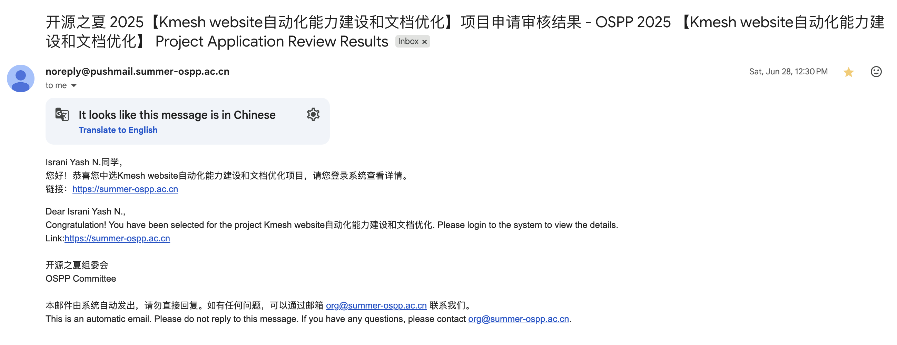

# OSPP 2025 | Automating Documentation and Release Workflows for Kmesh

## Introduction

Hello everyone! I’m **Yash Israni**, an open-source enthusiast passionate about automation, DevOps practices, and building tools that eliminate repetitive manual work.  

This summer, I had the privilege of participating in the **Open-Source Promotion Plan (OSPP) 2025**, where I collaborated with the [Kmesh](https://github.com/kmesh-net/kmesh) community to automate documentation and release workflows. Over the course of three months, I designed and implemented GitHub Actions pipelines that keep the Kmesh website always up-to-date, properly versioned, and reviewed for language quality.  

In this blog, I’ll share my journey—from acceptance to project execution, the technical decisions I made, and the lessons I learned along the way.  

<!-- truncate -->

## OSPP Program – Overview

The **Open-Source Promotion Plan (OSPP)**, organized by the Institute of Software, Chinese Academy of Sciences (ISCAS), gives students and early-career contributors the opportunity to gain hands-on experience by working on impactful open-source projects under the guidance of mentors.  

Each term runs for about **three months** (1 July – 30 September in my case). Contributors not only deliver real-world features but also learn how large open-source communities operate.  

---

## My Acceptance

I have always enjoyed contributing to open source, and my interests naturally align with automation and cloud-native tooling. When I saw that **Kmesh** was offering projects under OSPP 2025, I was immediately drawn to their proposal for automating documentation workflows.  

The project addressed a clear pain point: documentation updates and versioning were being done manually, often lagging behind releases. The opportunity to replace repetitive tasks with reliable automation felt both impactful and challenging.  

I received my **acceptance email on 28 June 2025**, and the program officially ran from **1 July to 30 September**. 

Interestingly, I was able to complete the majority of my project work **before the mid-term evaluation**, so that checkpoint was skipped, giving me extra time to refine the workflows and write proper usage guidelines.  

---

## Project Workthrough

### 1. Doc-Sync Workflow

- **Trigger:** on every push to the main branch  
- **Action:** opens a pull request in the website repository with the latest documentation updates  
- **Enhancements:** automatically labels the PR for triage and runs the site’s CI pipeline to validate changes  

### 2. Release Versioning Workflow

- **Trigger:** when a new Git tag is pushed (release event)  
- **Action:** generates a versioned snapshot of the documentation in the website repository  
- **Enhancements:** automatically opens a PR for any versioning-related changes  

### 3. Chinese Grammar Checker Workflow

- **Trigger:** on pull requests that modify Chinese documentation  
- **Action:** uses the **LanguageTool API** to detect grammar and style issues  
- **Enhancements:** posts line-level review comments as **warnings (non-blocking)** so contributors receive suggestions without being blocked from merging  

---

## Results

| Metric                       | Before (Manual)        | After (Automated)         | Improvement               |
| ---------------------------- | ---------------------- | ------------------------- | ------------------------- |
| Docs updated after release   | 3–5 days               | < 1 minute                | **>99% faster** 🚀        |
| Website versioning updates   | Delayed / inconsistent | Instant with each release | **100% reliable** ✅      |
| Review time for Chinese docs | ~20 min per PR         | ~1 min per PR             | **95% time saved** ⏱️     |

These workflows have effectively **eliminated delays and manual errors**, ensuring Kmesh documentation stays accurate and up-to-date.  

All three workflows are now live in both the Kmesh main repository and website repository under `.github/workflows`.  

---

## Key Technical Decisions

- Adopted **repository dispatch** for secure cross-repo communication, eliminating the need for long-lived personal tokens  
- Granted the GitHub Actions token **read & write permissions** only where necessary, while delegating other operations to a scoped bot account for better security  
- Implemented **Docusaurus-compatible versioning** by dynamically generating `versions.json`, keeping navigation in sync with releases  
- Added **robust error handling** in the doc-sync workflow to gracefully manage missing folders or files, preventing workflow crashes  

---

## Mentorship Experience

My mentors, **Li Zhencheng** and **Zhonghu Xu**, along with the Kmesh maintainers, were consistently supportive—whether through GitHub reviews or quick clarifications on Slack. Even though I delivered my main workflows ahead of schedule, their feedback helped me refine edge cases and improve overall reliability.  

As a recognition of my contributions and active involvement, the Kmesh community welcomed me as a **member of the organization**. This acknowledgment was both humbling and motivating, and it strengthened my commitment to continue contributing to Kmesh and supporting its growth.  

---

## Lessons Learned

1. **Automation empowers humans** – the goal isn’t to replace contributors but to free them from repetitive tasks so they can focus on meaningful reviews and design.  
2. **Start small and iterate** – building workflows in incremental, testable steps made debugging and maintenance far easier than deploying everything at once.  
3. **Security matters** – applying the principle of least privilege to tokens and permissions reduced risk while keeping automation safe.  
4. **Expect edge cases** – workflows behave differently across environments; testing on forks and multiple platforms prevented surprises in production.  
5. **Documentation is part of the code** – writing clear workflow descriptions and PR comments ensured maintainers trusted and understood what the automation was doing.  

---

## Acknowledgements

I would like to sincerely thank my mentors **Li Zhencheng** and **Zhonghu Xu** for their guidance, quick reviews, and encouragement. Thanks also to the **OSPP program staff** for ensuring smooth operations throughout the term.  

---

## Links

- [Project issue & Pull requests](https://github.com/kmesh-net/kmesh/issues/1412)  
- [OSPP website](https://summer-ospp.ac.cn)  
- [Yash Israni's github](https://github.com/yashisrani)  

---
