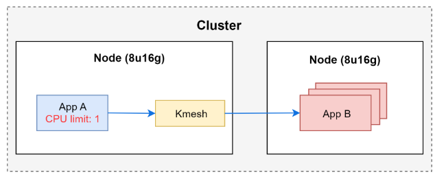
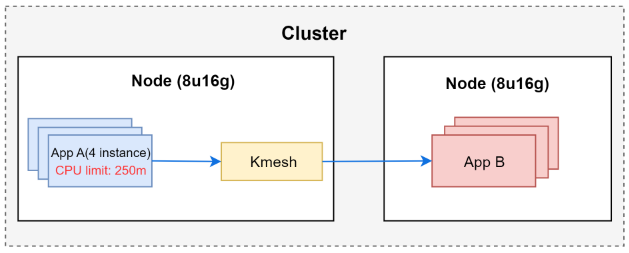

# 1. 测试环境


- K8S version: v1.27
- Kmesh version: 0.4
- Kernel version: 5.10
- Node flavor: 8U16G
- testing tool: fortio
- metric collecting tools: top, bpftop


# 2. 测试用例1 - POD CPU设置limit场景，测试Kmesh eBPF CPU 消耗
## 2.1 启动1个App A实例并固定App A POD的CPU limit，并生成负载，收集相应的Kmesh eBPF CPU消耗


设置App A的CPU limit为1(1个CPU)，并收集相应Kmesh的eBPF CPU消耗。

**注： 系统为8核，CPU limit为1，意味着POD最多消耗12.5%的 CPU**

测试结果：


**结果与结论：当APP A跑满1个CPU时，用户空间占用4%, 内核空间占用7.4%，一共消耗11.4%CPU, 小于POD CPU limit 12.5%，有两个可能原因**

- APP A + Kmesh eBPF共用POD CPU limit， Kmesh eBPF CPU受限于POD CPU limit
- 可能由于eBPF的性能过好，APP A不足以生成足够的负载，使eBPF消耗超过limit的CPU，需进一步进行2.2实验

## 2.2 启动多个App A实例，固定CPU limit，并生成负载，收集相应的Kmesh eBPF CPU消耗


启动了4个APP A实例，每个实例CPU limit设置为250m，4个实例共1个CPU

测试结果：


当APP A跑满1个CPU时，用户空间占用4.4%, 内核空间占用7.7%，一共消耗12.1%CPU。小于POD CPU limit 12.5%

**结果和结论：当APP A跑满1个CPU时，用户空间占用4.4%, 内核空间占用7.7%，一共消耗12.1%CPU, 小于POD CPU limit 12.5%，为了进一步验证此结论，进行2.3实验**

## 2.3 在测试2.2基础上修改eBPF代码，降低执行性能，使其消耗更多CPU，观测是否可以消耗超过POD CPU limit

在Kmesh eBPF代码中增加for循环：
```c
for (i;0;i<10000;i++) {}
```

测试结果：


当APP A跑满1个CPU时，用户空间占用CPU3.9%， 内核空间占用8.3%，一共消耗12.2% CPU， 仍然小于POD CPU limit(12.5%)，经多轮测试，APP A和eBPF的CPU消耗总和永远小于POD CPU limit


**结论: Kmesh eBPF和APP 共用POD CPU limit, Kmesh eBPF CPU受限于POD CPU limit**

# 3. 测试用例2 - POD CPU没有设置limit场景，测试Kmesh eBPF CPU 消耗
## 3.1 POD CPU没有设置limit场景，测试Kmesh eBPF CPU limit


创建8个APP A实例，设置为CPU limit无上限。 逐步修改APP A生成负载的进程数直到节点的CPU使用率为100%，收集Kmesh eBPF的CPU使用率。
测试结果(8核CPU总共8000m):
|threads|APP A CPU Usage|eBPF CPU usage|
|--|--|--|
|100|12.3%|1%|
|500|35%|4.1%|
|1000|61.7%|8.8%|
|3000|67%|9.5%|

系统总的CPU为8核即8000m。 当并发进程3000时，该节点CPU跑满100%。 此时APP A消耗CPU 67%， Kmesh eBPF消耗约9.5%。

**结论：**

- **APP A消耗CPU远高于eBPF消耗的CPU，无法实现将eBPF压爆，使用fortio压测场景Kmesh eBPF最多消耗CPU 9.5%。**
- **对于eBPF本身可消耗CPU上限需要进一步进行测试2**

## 3.2 eBPF CPU摸高测试，通过在eBPF代码中加入死循环/大量for循环, boost CPU使用率
[eBPF官方文档](https://ebpf-docs.dylanreimerink.nl/linux/concepts/verifier/)指出, eBPF程序有完善的安全机制，自动检测死循环，并严格限制for循环次数。在目前的Kernel版本(v5.10)， eBPF程序最多支持65535次for循环。

因此在代码中加入65535个for循环，并测试
```c
int i;
for (i=0;i<65535;i++) {
    bpf_printk("increase cpu usage");
}
```

测试结果:


当该节点CPU跑满100%。 Kmesh eBPF消耗约99.3% CPU。
此压测持续10分钟，测试期间内核以及集群内服务仍然稳定运行

**结论: 在Kmesh eBPF组件中增加eBPF支持极限数量的for循环场景下，eBPF可以消耗全部CPU，但是内核的安全机制保证系统稳定运行**


# 4. Kmesh eBPF组件 Memory limit测试
eBPF的内存消耗是有上限的：[官网文档](https://ebpf-docs.dylanreimerink.nl/linux/concepts/resource-limit/). 是通过cGroup 设置中的 memory.max设置的。

但是基于目前Kmesh的代码实现，内存是在Kmesh启动的时候分配的，在运行态，内存不增加。为了验证内存使用量，进行下面测试

## 4.1 在集群中分别创建1个，100个，1000个服务，记录eBPF 内存消耗
测试结果：
|服务数|eBPF Memory usage|
|--|--|
|1|23m|
|100|23m|
|1000|23m|

**测试结果: Kmesh eBPF内存消耗为23M，并保持不变，与服务数量无关**

## 4.2 在集群中创建1个服务APP A，并生成负载，观测eBPF内存消耗
**测试结果: Kmesh eBPF内存消耗为23M，并保持不变，与负载无关**
